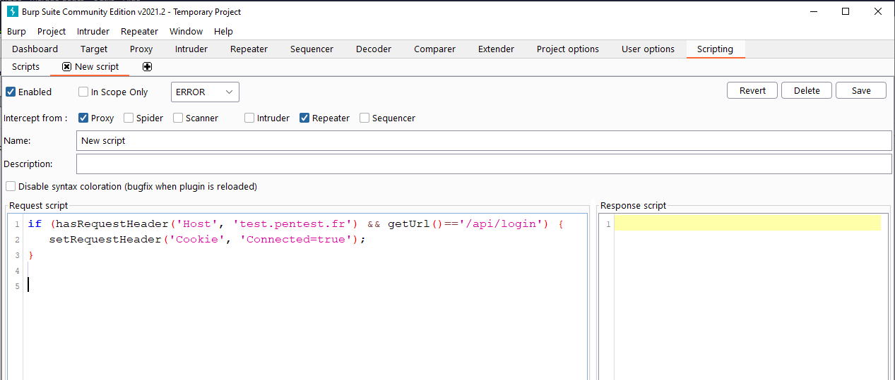
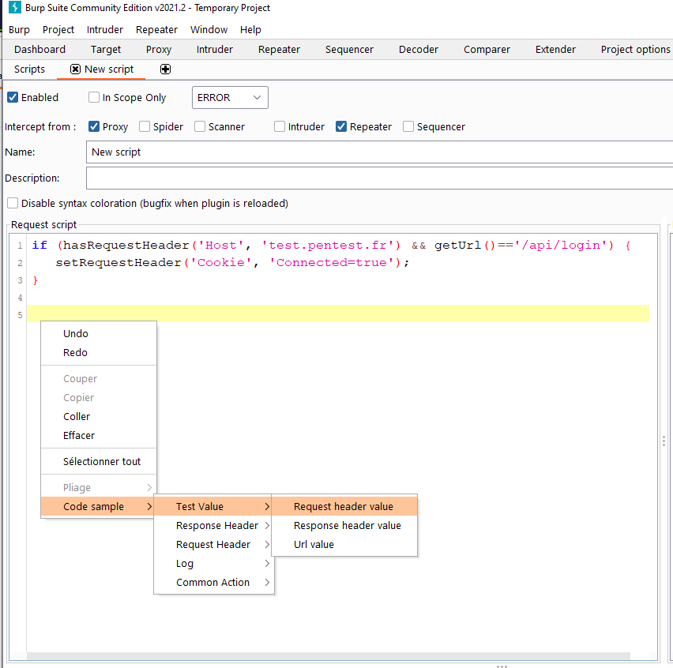

# Burp Scripting Extension

This extension add the ability to Burp Suite to inspect, modify requests and reponses with Javascript.
Useful if you want to replace header or body depending of other Headers.

Scripts are dynamically loaded, you can use BurpExtension API, or helper functions.

## Scripting tab

## Contextual code sample

Right clic in scripting text area in order to obtain code samples :

